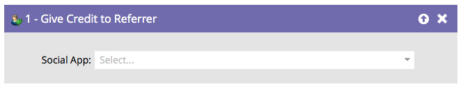

# Give Credit to Referrer {#give-credit-to-referrer}

When running a _referral offer_ or a _sweepstakes_, you can give credit to the referrer using different methods:

* Referred Visits
* Referred Sign-Ups
* **Smart List Trigger**
* Custom JavaScript Event

If you chose to use the **Smart List Trigger** option to specify a goal, you will need to use the **[!UICONTROL Give Credit to Referrer]** flow step.

   

1. Once you've built your campaign and decided what action to trigger on, simply find and select the Social App that you want to give credit to the referrer to.

   

   >[!NOTE]
   >
   >Make sure your social app is configured to use Smart List Trigger. See _Specify Goal for Referral Offer_ for details.

Excellent! Any person processed by this flow step will now give credit to its referrer.
