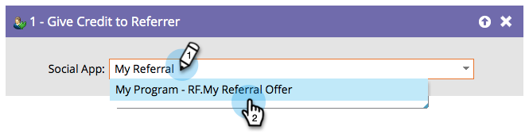

# Give Credit to Referrer {#give-credit-to-referrer}

## Overview {#overview}

When running a [referral offer](/help/marketo/product-docs/demand-generation/social/referral-offers/create-a-referral-offer.md) or a [sweepstakes](/help/marketo/product-docs/demand-generation/social/sweepstakes/create-sweepstakes.md), you can give credit to the referrer using different methods:

* Referred Visits
* Referred Sign-Ups
* **Smart List Trigger**
* Custom JavaScript Event

If you chose to use the **Smart List Trigger** option to specify a goal, you will need to use the **Give Credit to Referrer** flow step.

   

## Usage {#usage}

1. Once you have built your campaign and decided what action to trigger on, simply find and select the Social App that you want to give credit to the referrer to.

   

   >[!NOTE]
   >
   >Make sure your social app is configured to use Smart List Trigger. See  [Specify Goal for Referral Offer](/help/marketo/product-docs/demand-generation/social/referral-offers/specify-goal-for-referral-offer.md) for details.

Excellent! Any person processed by this flow step will now give credit to its referrer.
