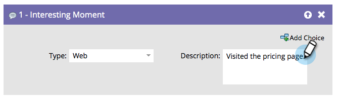

# Interesting Moment {#interesting-moment}

## Overview {#overview}

If you have Marketo Sales Insight, you can use the **Interesting Moment** flow step to give your sales team visibility into the cool things your people are doing.

## Usage {#usage}

1. Select the interesting moment **type** you want to use.

   

1. Create a **description** that explains the interesting moment to your sales team.

   

   >[!TIP]
   >
   >**Less is more**. Work with your sales team to make sure interesting moments are actually interesting.

You can also use [tokens in interesting moments](/help/marketo/product-docs/marketo-sales-insight/msi-for-salesforce/features/tabs-in-the-msi-panel/interesting-moments/trigger-tokens-for-interesting-moments.md) to make really useful dynamic descriptions.

>[!MORELIKETHIS]
>
>* [Using Interesting Moments](/help/marketo/product-docs/marketo-sales-insight/msi-for-salesforce/features/tabs-in-the-msi-panel/interesting-moments/using-interesting-moments.md)
>* [Tokens for Interesting Moments](/help/marketo/product-docs/marketo-sales-insight/msi-for-salesforce/features/tabs-in-the-msi-panel/interesting-moments/trigger-tokens-for-interesting-moments.md)
