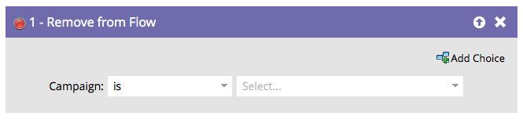

# Remove from Flow {#remove-from-flow}

Remove from Flow - Marketo Docs - Product Documentation

Imagine you have a smart campaign flow that uses "Send Alert" to remind a sales rep to call a hot prospect. It sends one message every day until the rep makes the call. You could use "Remove from Flow" in a trigger campaign once the prospect has been contacted to stop further alerts. It's like a smart campaign ejector seat for a person.

>[!NOTE]
>
>This would normally affect people that are sitting in a campaign flow's wait step.

#### Overview {#overview}

You can remove people from a campaign's flow by using the **Remove from Flow** flow step.

#### Usage {#usage}

Find and select the smart campaign you want to remove people from.

>[!NOTE]
>
>You can choose a specific smart campaign, or choose "this campaign" in the **Campaign** drop-down to select the campaign you're physically in at the time.

>[!NOTE]
>
>**Reminder**
>
>This functionality is meant to be used within the flow steps of a smart campaign.

