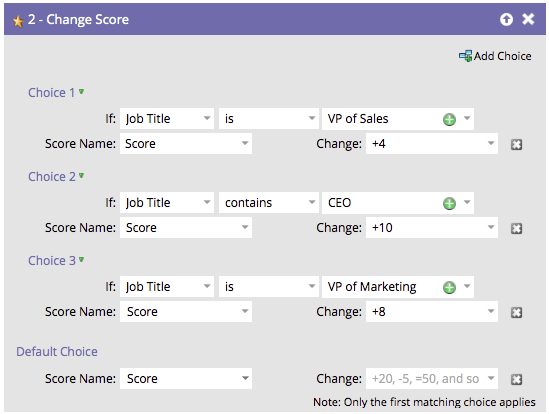
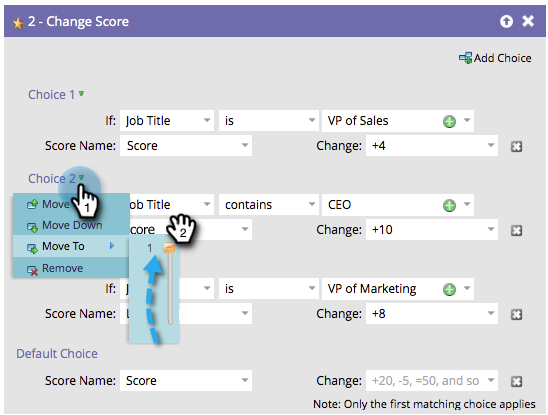

# Reorder Add Choice in a Flow Step {#reorder-add-choice-in-a-flow-step}

Since only the first matching choice applies to a person, order matters. If you want to change the order of the conditions set in a flow step, here's how.

1. Find the flow step you want to change the order of a choice for.

   

1. In this example, let's move Choice 3 up above Choice 2. Click on **[!UICONTROL Choice 3]** then click **[!UICONTROL Move Up]**.

   

   >[!NOTE]
   >
   >When reordering, you can **[!UICONTROL Move Up]**, **[!UICONTROL Move Down]**, or **[!UICONTROL Move To]**.

   Nice job! Now you know how to move a choice up/down by single increments.
   
   

**OPTIONAL STEP**: If you have many choices and need to move one multiple levels up or down, you can use this alternate method to save some time. Click on the choice you want to move, then under **[!UICONTROL Move To]**, drag the slider to the position you want to move the choice to.

   

It's that easy to re-organize the order of your flow step choices.
