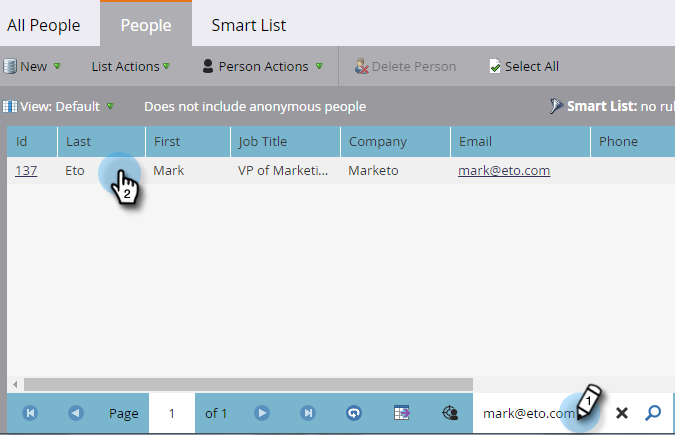

# Request Campaign {#request-campaign}

You can place people into a specific campaign by using the **Request Campaign** single flow step.

>[!NOTE]
>
>**FYI**
>
>Marketo is now standardizing language across all subscriptions, so you may see lead/leads in your subscription and person/people in docs.marketo.com. These terms mean the same thing; it does not affect article instructions. There are some other changes, too. [Learn more](http://docs.marketo.com/display/DOCS/Updates+to+Marketo+Terminology).

>[!NOTE]
>
>The campaign you are placing the person into must be active and have the ** [Campaign is Requested](../../../../product-docs/core-marketo-concepts/smart-campaigns/using-smart-campaigns/setting-up-a-trigger-smart-campaign-for-sales-using-campaign-is-requested.md)** trigger.

1. In the **Database**, find and select the desired person/people.

   

1. Click **Person Actions**, hover over **Special**, and select **Request Campaign**.

   

1. Select the campaign you want the person placed into and click **Run Now**.

   

1. On the upper-right of the screen, you'll see when it's done. Click **View Results**.

   

   Your person is now in the Requested Campaign.

   

   Awesome work!

>[!TIP]
>
>Use the **Campaign is Requested** trigger or filter to find people affected by this flow step.

