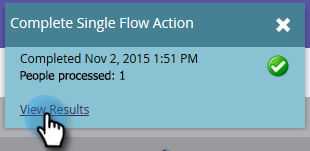

# Request Campaign {#request-campaign}

You can place people into a specific campaign by using the "[!UICONTROL Request Campaign]" single flow step.

>[!NOTE]
>
>The campaign you're placing the person into must be active and have the [Campaign is Requested](/help/marketo/product-docs/core-marketo-concepts/smart-campaigns/using-smart-campaigns/setting-up-a-trigger-smart-campaign-for-sales-using-campaign-is-requested.md){target="_blank"} trigger.

1. In the **[!UICONTROL Database]**, find and select the desired person/people.

   

1. Click **[!UICONTROL Person Actions]**, hover over **[!UICONTROL Special]**, and select **[!UICONTROL Request Campaign]**.

   

1. Select the campaign you want the person placed into and click **[!UICONTROL Run Now]**.

   

1. On the upper-right of the screen, you'll see when it's done. Click **[!UICONTROL View Results]**.

   

   Your person is now in the requested campaign.

   

   Awesome work!

>[!TIP]
>
>Use the "[!UICONTROL Campaign is Requested]" trigger or filter to find people affected by this flow step.
