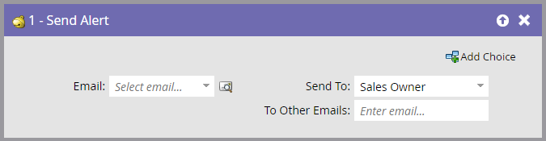
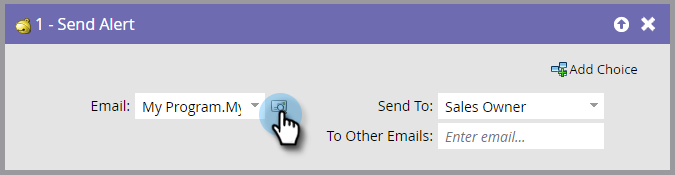
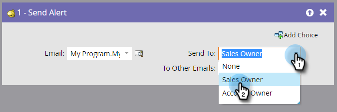

# Send Alert {#send-alert}

>[!NOTE]
>
>**FYI**
>
>Marketo is now standardizing language across all subscriptions, so you may see lead/leads in your subscription and person/people in docs.marketo.com. These terms mean the same thing; it does not affect article instructions. There are some other changes, too. [Learn more](http://docs.marketo.com/display/DOCS/Updates+to+Marketo+Terminology).

## Overview {#overview}

Marketo can send an email alert with person information to anyone - the sales owner, a partner, or someone else. Use the **Send Alert** flow step.

## Usage {#usage}

1. Find and select the email you want to send. 

    

    >[!NOTE]
    >
    >**Reminder**
    >
    >Your email alert must contain all of the header info and be in the **Approved** state.

1. You can click the preview icon to ensure that you've selected the correct email.

    

    >[!NOTE]
    >
    >**Reminder**
    >
    >Be sure to use the **Send Alert Info** token in your email.

1. Select the alert recipient. You can pick Sales Owner or Account Owner.

    

1. Optionally, add any other email addresses you want (separated by either a comma or a semicolon).

    

    >[!TIP]
    >
    >In trigger campaigns, you can use tokens in **To Other Emails** such as `{{lead.Territory Owner}}` or `{{my.Alert Recipient}}` as long as the values are valid email addresses. Tokens in **To Other Emails** will not work in a batch campaign.

That's it! Now you know how to use the **Send Alert** flow step. 

>[!NOTE]
>
>**Related Articles**
>
>[Create an Email](../../../../product-docs/email-marketing/general/creating-an-email/create-an-email.md)

