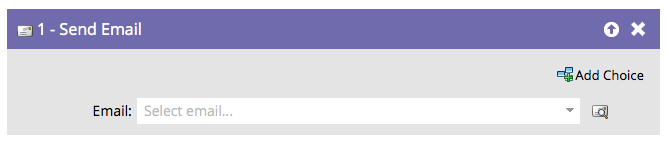

# Send Email {#send-email}

The "[!UICONTROL Send Email]" flow step can be used as part of campaigns or as a single flow step to send emails to your people.

You can preview the selected email right from the flow step.

1. Find and select the email you want to send.

   

   >[!NOTE]
   >
   >Your email must be approved if you want to select it in the flow step.

1. Click on the preview icon to see the currently selected email.

   

A new tab/window opens where you can see the email.
