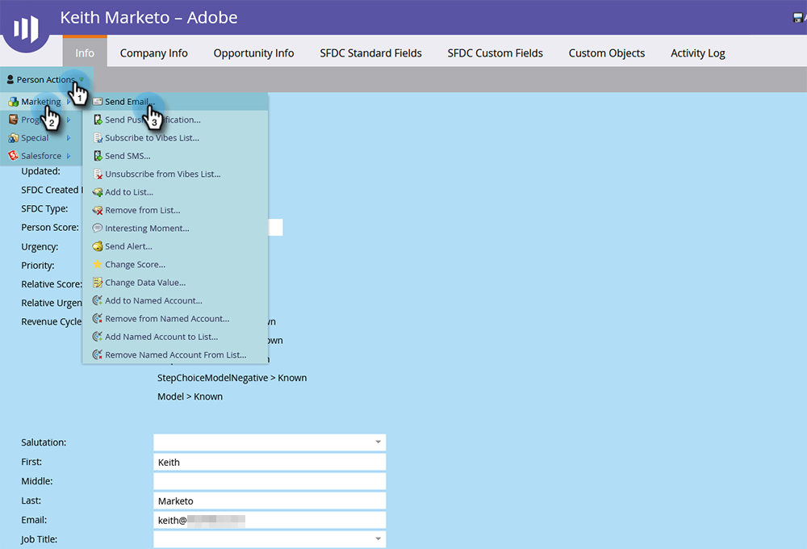
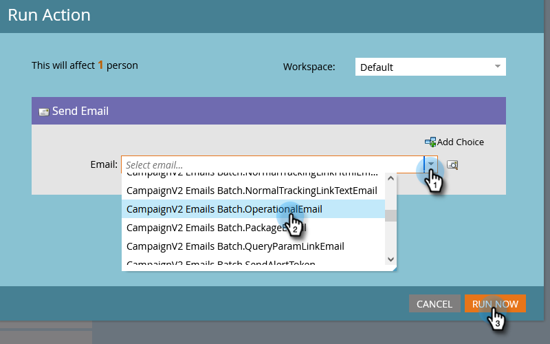

# Single Flow Actions from Person Detail Page {#single-flow-actions-from-person-detail-page}

In addition to running single flow actions from within a Smart List, you can also run them directly on a Person Detail page.

1. Click **[!UICONTROL Database]**.

   

1. Locate the desired person.

   

1. Click the **[!UICONTROL Person Actions]** drop-down and select the flow step of your choice. In this example we'll use [Send Email](/help/marketo/product-docs/core-marketo-concepts/smart-campaigns/flow-actions/send-email.md){target="_blank"}.

   

1. Select the desired email and click **[!UICONTROL Run Now]**.

   

>[!NOTE]
>
>If your instance contains Workspaces/Partitions and you navigate to a Person Detail page directly (e.g., via link) instead of coming from a page/asset tied to a Workspace, you'll have to also choose a Workspace in Step 4.
