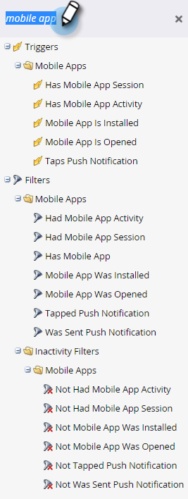
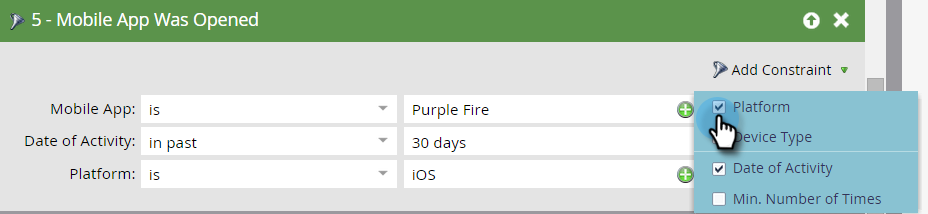
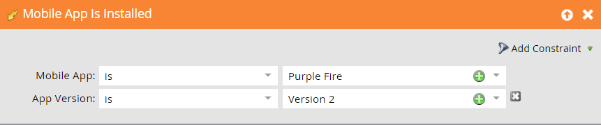
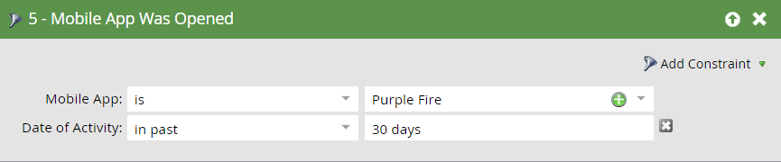
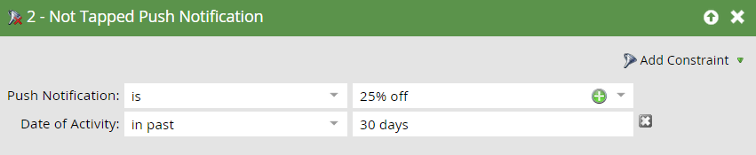

# Triggers and Filters for Mobile Smart Campaigns {#triggers-and-filters-for-mobile-smart-campaigns}

You can set up triggers and filters for a Mobile App smart campaign.

For most activities, there are a trigger, a filter, and an inactivity filter. Use inactivity filters to track an action, such as tapping a push notification, that *didn’t* happen.

* Mobile App Is/Was Installed
* Mobile App Is/Was Opened
* Has/Had Mobile App Activity
* Has/Had Mobile App Session
* Taps/Tapped Mobile Push Notification

There are only filters for this activity:

* Was Sent Push Notification - filter and inactivity filter

Search for **mobile app** in the right panel to list all of the Mobile App triggers and filters.

## Constraints {#constraints}

Use constraints with triggers and filters to further sort the data.

All triggers and filters, except for Was Sent Push Notification, contain these two standard constraints:

* Device Type - [!DNL iPod], iPhone, [!DNL iPhone 6 Plus], [!DNL iPad mini], iPad, Android smartphone, Android tablet, Unknown (this is a preset list)

* Platform - iPhone or Android

Some triggers and filters offer additional constraints, such as:

* App Version - A way to target people who are not on latest version. For example, if the latest app version is 2.0, you can use it to find people who are NOT on App Version 2.0

* Install Source - Currently, the only option is API

* Locale - The setting on the device

* Mobile App - The name of specific app. Useful to specify if you have more than one

* Platform Version - The version of the OS

* Session Length (seconds) - Session time when the app is in the foreground

* Is Push Enabled - **True** means that push notifications can be sent. **False** means that they can't; for example, the person may have opted out of receiving push notifications

## Triggers and Filters {#triggers-and-filters}

**Has Mobile App**

Use this filter to find out all people who have ever had your app installed. This is available only as a filter.

>[!NOTE]
>
>The filter will find both current and former installs as Marketo does not track app uninstalls.

**Constraints**: Device Type, Platform, Mobile App, Mobile App Version, Device Type, Install Source, Is Push Enabled, and Locale

>[!TIP]
>
>It’s a best practice to specify Has Mobile App = true and Is Push Enabled = true, as well as the name of your mobile app when defining the smart list of who should receive a push notification.

Mobile App Is/Was Installed

* Mobile App is Installed - trigger

* Mobile App was Installed - filter

* NOT Mobile App was Installed - inactivity filter

**Constraints**: Device Type, Platform, App Version, Locale, and Install Source

Mobile App Is/Was Opened

* Mobile App is Opened - trigger

* Mobile App was Opened - filter

* NOT Mobile App was Opened - inactivity filter

**Constraints**: Device Type and Platform

Has/Had Mobile App Activity

These provide a powerful way to track custom mobile activity. You'll need to work with your developer to set up tracking [for Android](https://developers.marketo.com/documentation/mobile/installation-instructions-on-android) and [for iOS](https://developers.marketo.com/documentation/mobile/installation-instructions-on-ios).

* Has Mobile App Activity - trigger

* Had Mobile App Activity - filter

* NOT Had Mobile App Activity - inactivity filter

**Constraints**: Device Type and Platform, plus five additional ones:

* Action - Custom mobile activity

* Action Type - (optional) Text field used to categorize multiple actions

* Action Details - (optional) Text field that provides additional information about an action

* Action Metric - (optional) Numeric field that provides additional information about an action (for example, price)

* Action Length (seconds) - (optional) Numeric field that can be used to capture how long it took a user to complete an action

The Action constraints let you use the trigger and filters to track mobile activity very closely.

>[!NOTE]
>
>**Example**
>
>Under the action type of *Shopping*, here's a very specific action, with the other constraints defining it:
>
>* Bought a shirt
>   * It was red
>   * It cost $30
>   * It took 20 seconds to buy

Here's how the filter looks in Marketo:

   

>[!NOTE]
>
>**Example**
>
>You can have multiple actions under the same action type. In fact, your normal shopping experience may involve several columns under Shopping! How about some socks to go with that?
>
>| Action Type |Shopping |Shopping |
>|---|---|---|
>| Action |Bought shirt |Bought pants |
>| Action Details |Color |Color |
>| Action Metric |Price |Price |

**Has/Had Mobile App Session**

* Has Mobile App Session - trigger

* Had Mobile App Session - filter

* NOT Had Mobile App Session - inactivity filter

**Constraints**: Device Type, Platform, and Session Length (seconds)

Taps/Tapped Push Notification

* Taps Push Notification - trigger

* Tapped Push Notification - filter

* NOT Tapped Push Notification - inactivity filter

**Constraints**: Device Type, Platform, Mobile App Version, Push Notification, and Platform Version

>[!TIP]
>
>Use the Not Tapped Push Notification inactivity filter to find people who didn’t tap a push notification recently sent to them, so that you can follow up via email.

**Was Sent Push Notification** This activity is available only as a filter.

* Was Sent Push Notification - filter

* NOT Was Sent Push Notification - inactivity filter

**Constraints**: Push Notification and Mobile App

>[!MORELIKETHIS]
>
>* [Add a Constraint to a Smart List Filter](/help/marketo/product-docs/core-marketo-concepts/smart-lists-and-static-lists/using-smart-lists/add-a-constraint-to-a-smart-list-filter.md)
>* [Use Inactivity Filters in a Smart List](/help/marketo/product-docs/core-marketo-concepts/smart-lists-and-static-lists/using-smart-lists/use-inactivity-filters-in-a-smart-list.md)
