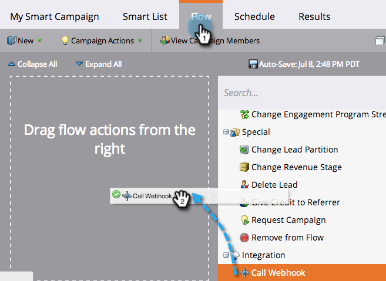
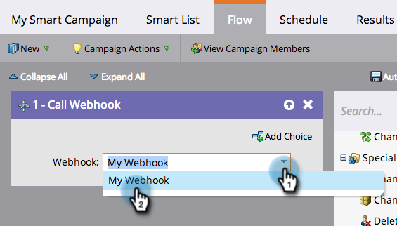
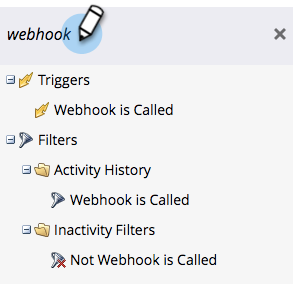

# Use a Webhook in a Smart Campaign {#use-a-webhook-in-a-smart-campaign}

To use a [webhook](https://developers.marketo.com/documentation/webhooks/), add it to a [smart campaign](/help/marketo/product-docs/core-marketo-concepts/smart-campaigns/flow-actions/add-a-flow-step-to-a-smart-campaign.md) as a flow action.

>[!AVAILABILITY]
>
>Not all customers have purchased this functionality. Contact your sales rep for details.

1. [Create a smart campaign](/help/marketo/product-docs/core-marketo-concepts/smart-campaigns/creating-a-smart-campaign/create-a-new-smart-campaign.md).

   >[!NOTE]
   >
   >Webhooks can only be used in trigger campaigns.

1. Go to the **Flow** tab and drag in the **Call Webhook** flow action.

   

1. Select the Webhook.

   

1. You can also use Webhooks in a smart list.

   

1. Finally, you can use Webhooks in **Add Choice** in a flow step.

   
