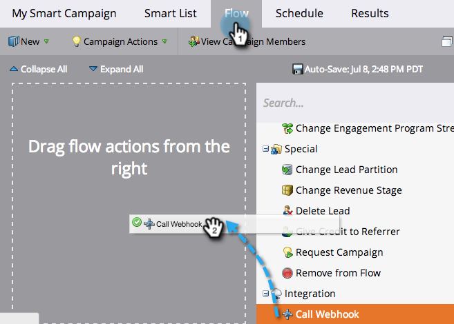
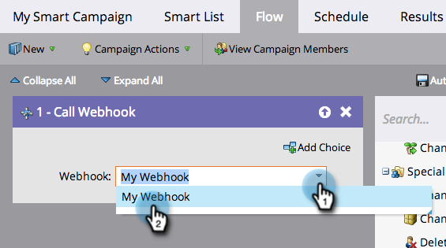
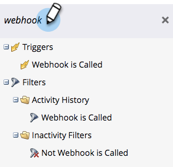

# Use a Webhook in a Smart Campaign {#use-a-webhook-in-a-smart-campaign}

To use a [webhook](https://experienceleague.adobe.com/en/docs/marketo-developer/marketo/webhooks/webhooks){target="_blank"}, add it to a [Smart Campaign](/help/marketo/product-docs/core-marketo-concepts/smart-campaigns/flow-actions/add-a-flow-step-to-a-smart-campaign.md){target="_blank"} as a flow action.

>[!AVAILABILITY]
>
>Not all Marketo Engage users have purchased this functionality. Contact the Adobe Account Team (your Account Manager) for details.

1. [Create a Smart Campaign](/help/marketo/product-docs/core-marketo-concepts/smart-campaigns/creating-a-smart-campaign/create-a-new-smart-campaign.md){target="_blank"}.

   >[!NOTE]
   >
   >Webhooks can only be used in Trigger Campaigns.

1. Go to the **[!UICONTROL Flow]** tab and drag in the **[!UICONTROL Call Webhook]** flow action.

   

1. Select the **[!UICONTROL Webhook]**.

   

1. You can also use Webhooks in a Smart List.

   

1. Finally, you can use Webhooks in **[!UICONTROL Add Choice]** in a flow step.

   
