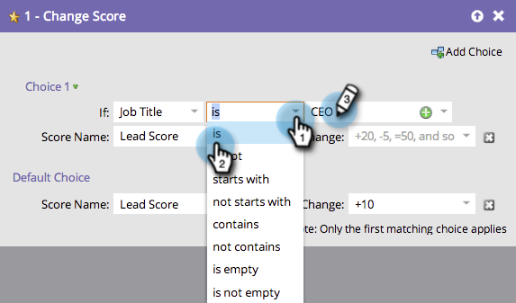

# Use Add Choice in a Flow Step {#use-add-choice-in-a-flow-step}

>[!NOTE]
>
>**Prerequisites**
>
>* [Add a Flow Step to a Smart Campaign](add-a-flow-step-to-a-smart-campaign.md)
>

**Add Choice** lets you use a flow step and say "It depends" when you are choosing the details.

1. Under the&nbsp;**Flow**&nbsp;tab of the smart campaign, add any&nbsp;flow step and then click on **Add Choice**.

   

1. Select the choice condition.

   

1. Choose the choice operator and enter a choice value. This sets your criteria or choice. 

   

1. Enter a flow step value for the choice.

   

   >[!CAUTION]
   >
   >Tokens will **not** work in the condition part of a choice flow step.

1. Repeat the above steps to add multiple choices, and then add/adjust the default value.

   

   >[!TIP]
   >
   >You can set any of your flow steps to --Do Nothing--, in which case no action will be taken on that choice.

   >[!CAUTION]
   >
   >Only the first matching choice is applied to the flow step. Learn how to&nbsp; [reorder "Add Choice" in a flow action](reorder-add-choice-in-a-flow-step.md).

   >[!NOTE]
   >
   >**Related Articles**
   >
   >    
   >    
   >    * [Reorder "Add Choice" in a Flow Step](reorder-add-choice-in-a-flow-step.md)
   >    
   >

Great! You can now create a single smart campaign with flow step choices instead of creating multiple smart campaigns for each choice. 