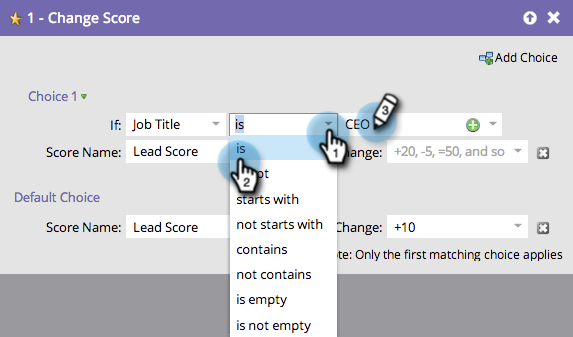

# Use Add Choice in a Flow Step {#use-add-choice-in-a-flow-step}

>[!PREREQUISITES]
>
>[Add a Flow Step to a Smart Campaign](/help/marketo/product-docs/core-marketo-concepts/smart-campaigns/flow-actions/add-a-flow-step-to-a-smart-campaign.md){target="_blank"}

"Add Choice" lets you use a flow step and say 'it depends' when you are choosing the details.

1. Under the **[!UICONTROL Flow]** tab of the Smart Campaign, add any flow step and then click on **[!UICONTROL Add Choice]**.

   

1. Select the choice condition.

   

1. Choose the choice operator and enter a choice value. This sets your criteria or choice.

   

1. Enter a flow step value for the choice.

   

   >[!CAUTION]
   >
   >Tokens will _not_ work in the condition part of a choice flow step.

1. Repeat the above steps to add multiple choices, and then add/adjust the default value.

   

   >[!TIP]
   >
   >You can set any of your flow steps to --Do Nothing--, in which case no action will be taken on that choice.

   >[!CAUTION]
   >
   >Only the first matching choice is applied to the flow step. Learn how to [reorder "Add Choice" in a flow action](/help/marketo/product-docs/core-marketo-concepts/smart-campaigns/flow-actions/reorder-add-choice-in-a-flow-step.md){target="_blank"}.

   You can now create a single Smart Campaign with flow step choices instead of creating multiple Smart Campaigns for each choice.

   >[!MORELIKETHIS]
   >
   >[Reorder Add Choice in a Flow Step](/help/marketo/product-docs/core-marketo-concepts/smart-campaigns/flow-actions/reorder-add-choice-in-a-flow-step.md){target="_blank"}
