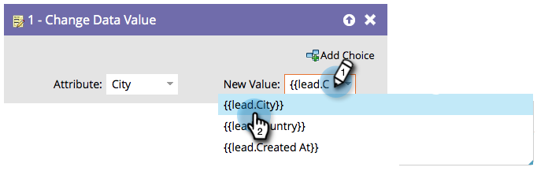

# Use Tokens in Flow Steps {#use-tokens-in-flow-steps}

>[!PREREQUISITES]
>
>[Add a Flow Step to a Smart Campaign](/help/marketo/product-docs/core-marketo-concepts/smart-campaigns/flow-actions/add-a-flow-step-to-a-smart-campaign.md){target="_blank"}

A token is a variable. You use it in emails, Landing Pages, and Smart Campaigns to make your life easier. You can use [My Tokens](/help/marketo/product-docs/core-marketo-concepts/programs/tokens/understanding-my-tokens-in-a-program.md){target="_blank"} (custom tokens) in flow steps, webhooks, emails, and landing pages. You can use tokens to include variable content in these flow steps:

* Change Data Value
* Change Program Member Data
* Interesting Moment
* [!DNL Salesforce] Campaign Steps (add, remove, change status)
* Create Task
* Send Alert (in Trigger Campaigns only)

1. In the flow step, start typing `{{` to get token categories.

   

   >[!NOTE]
   >
   >Check out [Tokens Overview](/help/marketo/product-docs/demand-generation/landing-pages/personalizing-landing-pages/tokens-overview.md){target="_blank"} for a list of several available tokens.

1. Keep typing until you find the token you want and click to select.

   

   >[!TIP]
   >
   >Multiple tokens can be used in Interesting Moment, Create Task, and Send Alert flow steps.

   >[!NOTE]
   >
   >Program Member Custom Field Tokens can be used in: Create Task, Create Task in Microsoft, Interesting Moments, Change Data Value Flow Actions, and Webhooks.

   The data will be pulled from the token when the Smart Campaign runs.

   >[!MORELIKETHIS]
   >
   >* [Managing My Tokens](/help/marketo/product-docs/core-marketo-concepts/programs/tokens/managing-my-tokens.md){target="_blank"}
   >* [Understanding My Tokens in a Program](/help/marketo/product-docs/core-marketo-concepts/programs/tokens/understanding-my-tokens-in-a-program.md){target="_blank"}
