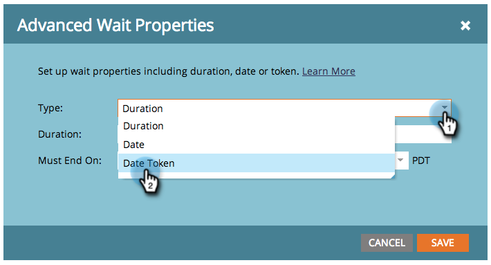
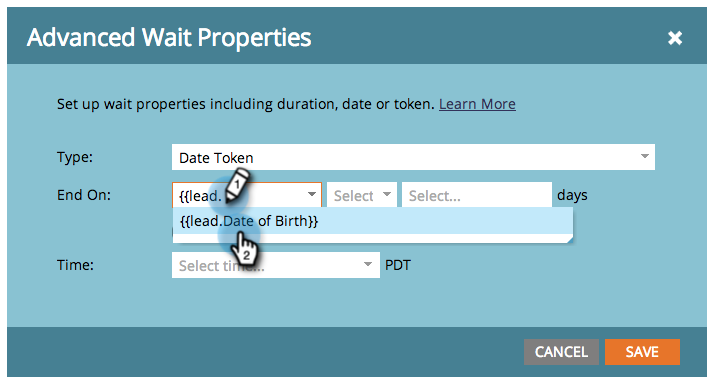
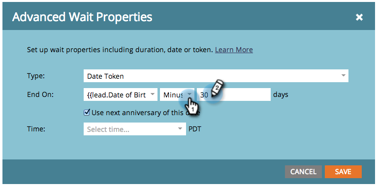

# Use a Date Token in a Wait Flow Step {#use-a-date-token-in-a-wait-flow-step}

You can use the Wait flow step to pause a person's journey through a smart campaign until a particular date that uses a date token. You can also modify the end date by some number of days.

>[!NOTE]
>
>This only applies to trigger campaigns. You cannot use this feature in batch campaigns. 

1. In your smart campaign **Flow** tab, drag over the **Wait** flow step.

   

1. Click the gear icon to the right.

   

1. From the **Type** drop-down, select **Date Token**.

   

1. Choose a Date token to specify when the Wait step should end:

    * `{{my._____}}`
    * `{{lead.______}}`
    * `{{company.______}}`
    * `{{system._______}}`

   

1. To wait until the next anniversary of the date occurring in the current or next calendar year, check the box. 

   

   >[!TIP]
   >
   >Use this option on date tokens that refer to dates in the past, such as a birthday or contract start date.

1. Optionally, you can modify the end date by a specified number of days. 

   

   >[!NOTE]
   >
   >You can also specify the number of days using a `{{lead.` or `{{company.` token that represents an integer field,  or a `{{my.` token of number type.

1. Click Save. 

   

   >[!NOTE]
   >
   >**Related Articles**
   >
   >* [Use a Duration in a Wait Flow Step](use-a-duration-in-a-wait-flow-step.md)
   >* [Use a Specific Date in a Wait Flow Step](use-a-specific-date-in-a-wait-flow-step.md)
 