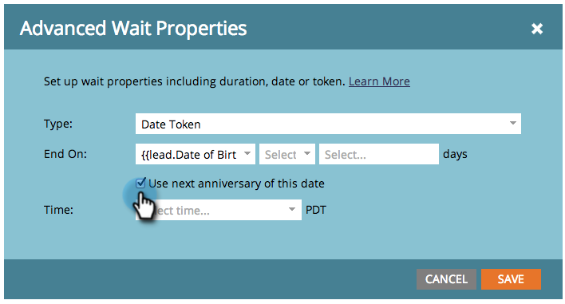

# Use a Date Token in a Wait Flow Step {#use-a-date-token-in-a-wait-flow-step}

You can use the Wait flow step to pause a person's journey through a Smart Campaign until a particular date that uses a date token. You can also modify the end date by some number of days.

>[!NOTE]
>
>This only applies to Trigger Campaigns. You cannot use this feature in Batch Campaigns.

1. In your Smart Campaign **[!UICONTROL Flow]** tab, drag over the **[!UICONTROL Wait]** flow step.

   

1. Click the gear icon.

   

1. From the **[!UICONTROL Type]** drop-down, select **[!UICONTROL Date Token]**.

   

1. Choose a Date token to specify when the Wait step should end:

    * `{{my._____}}`
    * `{{lead.______}}`
    * `{{company.______}}`
    * `{{system._______}}`

   

1. To wait until the next anniversary of the date occurring in the current or next calendar year, check the box.

   

   >[!TIP]
   >
   >Use this option on date tokens that refer to dates in the past, such as a birthday or contract start date.

1. Optionally, you can modify the end date by a specified number of days.

   

   >[!NOTE]
   >
   >You can also specify the number of days using a `{{lead.` or `{{company.` token that represents an integer field,  or a `{{my.` token of number type.

1. Click **[!UICONTROL Save]**.

   

   >[!MORELIKETHIS]
   >
   >* [Use a Duration in a Wait Flow Step](/help/marketo/product-docs/core-marketo-concepts/smart-campaigns/flow-actions/wait/use-a-duration-in-a-wait-flow-step.md){target="_blank"}
   >* [Use a Specific Date in a Wait Flow Step](/help/marketo/product-docs/core-marketo-concepts/smart-campaigns/flow-actions/wait/use-a-specific-date-in-a-wait-flow-step.md){target="_blank"}
