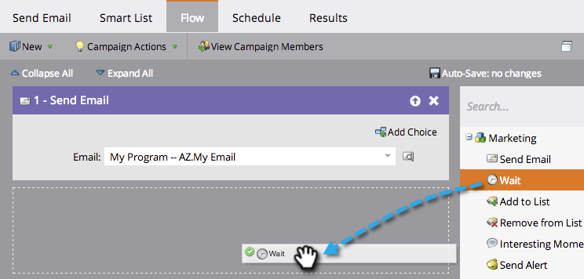
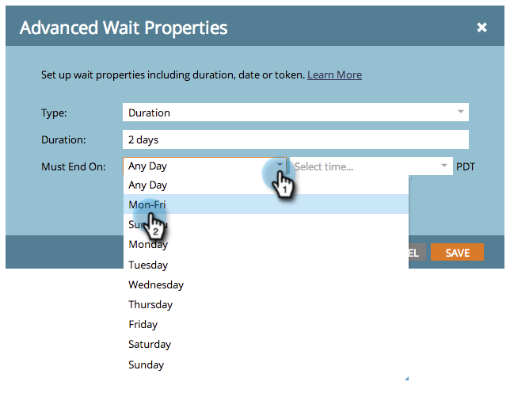

# Use a Duration in a Wait Flow Step {#use-a-duration-in-a-wait-flow-step}

You can use the Wait flow step to pause a person's journey through a smart campaign for a certain duration of time. You can also specify criteria for the day of the week and time when it ends.

1. In your smart campaign **Flow** tab, drag over the **Wait** flow step.

   

1. Enter how long you want to pause.

   

1. That's it! The flow will pause for your specified duration. For advanced options, click the gear icon to the right.

   

1. Specify the day of the week when the wait step should end.

   

1. Optionally, specify the time. Click **Save**.

   

   >[!NOTE]
   >
   >**Example**
   >
   >A person triggers a smart campaign on Friday at 5pm. The wait step is advanced: 48 hours and must end on Mon-Fri at 9am.
   >
   >The result would be that the person would continue in the flow on **Monday, 9am**. This is the first M-F date after 48 hours.

   >[!NOTE]
   >
   >The duration, dates, times, and days used are all based on your subscription’s time zone.

   >[!MORELIKETHIS]
   >
   >* [Use a Specific Date in a Wait Flow Step](/help/marketo/product-docs/core-marketo-concepts/smart-campaigns/flow-actions/wait/use-a-specific-date-in-a-wait-flow-step.md)
   >* [Use a Date Token in a Wait Flow Step](/help/marketo/product-docs/core-marketo-concepts/smart-campaigns/flow-actions/wait/use-a-date-token-in-a-wait-flow-step.md)
