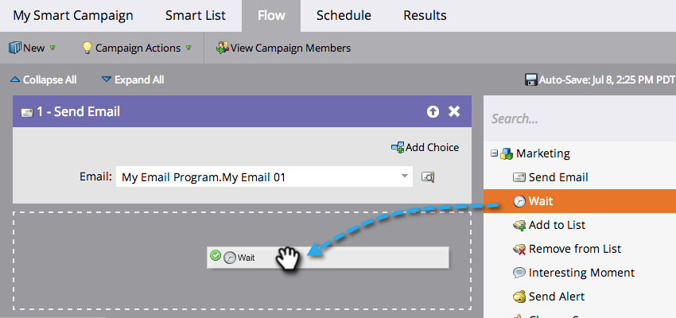
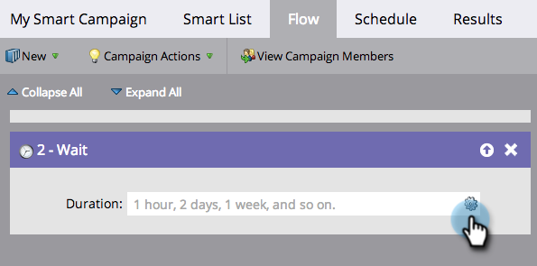
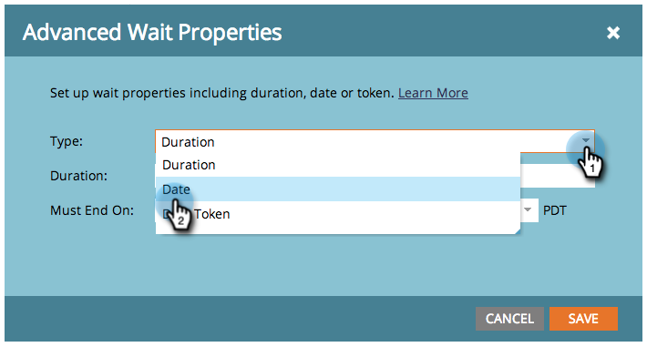
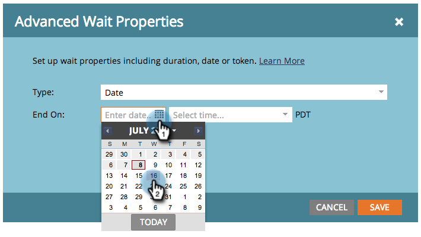

# Use a Specific Date in a Wait Flow Step {#use-a-specific-date-in-a-wait-flow-step}

You can use the "[!UICONTROL Wait]" flow step to pause a person's journey through a Smart Campaign until a particular date.

1. In your Smart Campaign **[!UICONTROL Flow]** tab, drag over the **[!UICONTROL Wait]** flow step.

   

1. Click the gear icon.

   

1. From the **[!UICONTROL Type]** drop-down, select **[!UICONTROL Date]**.

   

1. Select the specific date when you want to resume.

   

1. Specify the time (optional) and click **[!UICONTROL Save]**.

   

>[!MORELIKETHIS]
>
>* [Use a Duration in a Wait Flow Step](/help/marketo/product-docs/core-marketo-concepts/smart-campaigns/flow-actions/wait/use-a-duration-in-a-wait-flow-step.md){target="_blank"}
>* [Use a Date Token in a Wait Flow Step](/help/marketo/product-docs/core-marketo-concepts/smart-campaigns/flow-actions/wait/use-a-date-token-in-a-wait-flow-step.md){target="_blank"}
