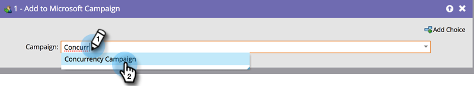

# Add or Remove People from your Dynamics Campaign {#add-or-remove-people-from-your-dynamics-campaign}

## Add to Dynamics Campaign {#add-to-dynamics-campaign}

This flow step can be used in Marketo Smart Campaigns to add people as leads or contacts in a Microsoft campaign. If the lead does not yet exist in Dynamics, it will automatically be synced over and get added to the campaign.

>[!NOTE]
>
>This flow action is available for Trigger Campaigns only.

In your smart campaign, find and select the Dynamics campaign you want to add your people to.

>[!NOTE]
>
>If you can't see a Dynamics campaign in the campaign list:
>
>* Make sure the Campaign Sync is functional
>* The campaign is not active in Microsoft Dynamics

The system automatically creates a campaign-specific static marketing List, each for leads and contacts, to add the person to. It is a one-time action and once for subsequent syncs to the campaign, the same Marketing List is used. The naming standard adopted for the static Marketing List name is `Mkto-leads-<uniqueID>` for leads and `Mkto-contacts-<uniqueID>` for contacts.

Associating these Marketo-generated Marketing Lists to other campaigns could lead to confusing behavior. For example: adding to one campaign would also result in adding to the second campaign. Similarly, dissociating the Marketo-generated Marketing List from the Campaign in Dynamics is also not recommended.

## Remove from Dynamics Campaign {#remove-from-dynamics-campaign}

This flow step can be used in Marketo Smart Campaigns to remove people from a Microsoft campaign. This removes only those leads from a Campaign which have been previously added to the Campaign through the flow action “Added to Microsoft Campaign”.  

>[!NOTE]
>
>This flow action is available for Trigger Campaigns only.

In your smart campaign, find and select the Dynamics campaign you want to remove your people from.

>[!NOTE]
>
>If you don't see a Dynamics campaign in the campaign list:
>
>* Make sure the Campaign Sync is functional
>* The campaign is not active in Microsoft Dynamics
