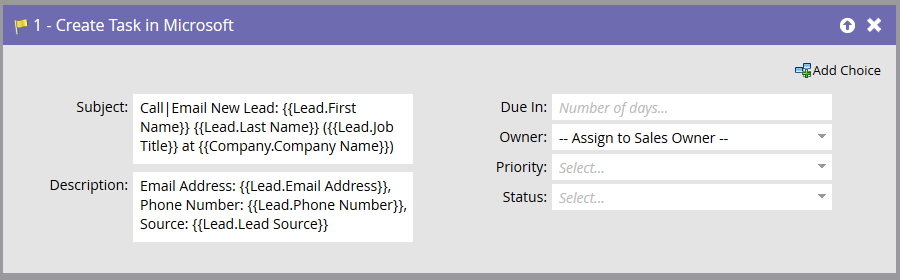

# Create Task in Microsoft {#create-task-in-microsoft}

As a marketer, you have information that can assist sales in closing deals. You can create tasks to let them know what they should do and when they should do it.

Create Task in Microsoft creates a task under Activities related with the Person (Lead or Contact) in Microsoft.

>[!NOTE]
>
>This flow step will **only work when used with triggers**, not filters, in your smart campaign.

By default, the flow step will look like this:

>[!NOTE]
>
>When the Marketo Sync User is creating tasks, **Due In** is a required field for the task to be created in Microsoft. Marketo will input five days by default if no value is entered.

Customize all fields to create the task the way you want it.

>[!NOTE]
>
>The field “Status” specified for the task in the Flow Action updates the field: “Status Reason” in Microsoft.

>[!TIP]
>
>You can use `{{lead.tokens}}`, `{{company.tokens}}`, `{{campaign.tokens}}` and `{{system.tokens}}` in the **Subject** and **Description**. See [Tokens for Flow Steps](/help/marketo/product-docs/core-marketo-concepts/smart-campaigns/flow-actions/use-tokens-in-flow-steps.md) for more details.
