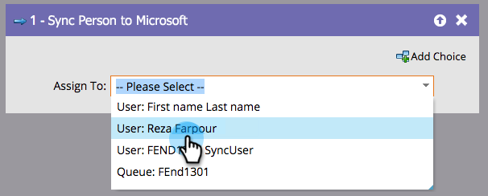

# Sync Person to Microsoft {#sync-person-to-microsoft}

This feature is only for those who integrate Marketo Engage with [!DNL Microsoft Dynamics].

## Overview {#overview}

This flow step will insert Marketo-created people into your [!DNL Dynamics] CRM.

## Usage {#usage}

You can set a [!DNL Dynamics] user as the person owner.

>[!NOTE]
>
>When using the "[!UICONTROL Sync Person to Microsoft]" flow action (in a Trigger Campaign only), the lead/contact will be created in real-time in Dynamics.
