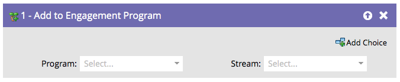

# Add to Engagement Program {#add-to-engagement-program}

The Smart Campaign that you build with this flow step will be the gateway to your engagement program.

1. Select the engagement program you want to add the people to.

   

1. Select the stream you want to place the people in.

   

   >[!NOTE]
   >
   >You cannot add a person to multiple streams within the same program.
