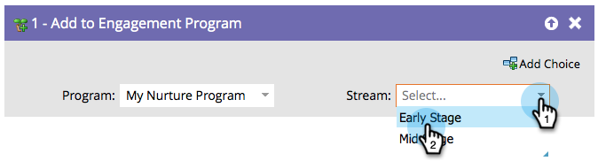

# Add to Engagement Program {#add-to-engagement-program}

>[!NOTE]
>
>**FYI**
>
>Marketo is now standardizing language across all subscriptions, so you may see lead/leads in your subscription and person/people in docs.marketo.com. These terms mean the same thing; it does not affect article instructions. There are some other changes, too. [Learn more](http://docs.marketo.com/display/DOCS/Updates+to+Marketo+Terminology).

## Overview {#overview}

The smart campaign that you build with this flow step will be the gateway to your engagement program.

## Usage {#usage}

1. Select the engagement program you want to add the people to.

   

1. Select the stream you want to place the people in.

   

   >[!NOTE]
   >
   >You cannot add a person to multiple streams within the same program.

