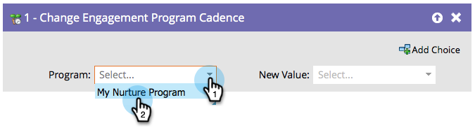

# Change Engagement Program Cadence {#change-engagement-program-cadence}

Once a person is being nurtured by an engagement program, you can temporarily pause nurturing for them by using this flow step.

   

   >[!NOTE]
   >
   >If a person is not a member of the program and runs through this flow step, they will automatically be added as a member and into your first stream.

1. Select the engagement program.

   

1. Select **[!UICONTROL Paused]** as the **[!UICONTROL New Value]** to stop the person from receiving content.

   

  You can set the person back to **[!UICONTROL Normal]** if you want them to begin receiving content again.
