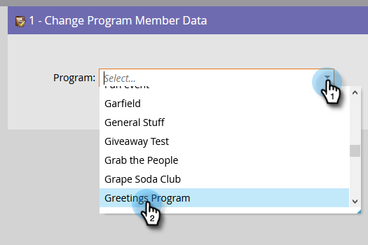
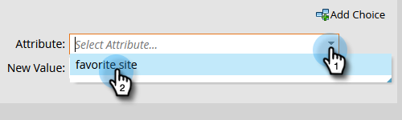
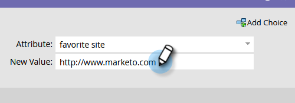

# Change Program Member Data {#change-program-member-data}

You can use Marketo to update the value of a field by utilizing the Change Data Value flow action.

>[!NOTE]
>
>You can also block a field from being updated. See Block Updates to a Field for details.

1. In your Smart Campaign's Flow tab, bring over the **[!UICONTROL Change Program Member Data]** flow step and choose the desired program.

   

1. Find and select the attribute you want to change the value of.

   

1. Enter the Attribute value you want.

   

>[!NOTE]
>
>You can also use tokens in [!UICONTROL New Value].

Now just run the Smart Campaign, and you're done!

>[!TIP]
>
>If you want to clear the fields instead of updating them, you can enter "NULL" (no quotes, all caps) as the [!UICONTROL New Value].

>[!MORELIKETHIS]
>
>* [Use Tokens in Flow Steps](/help/marketo/product-docs/core-marketo-concepts/smart-campaigns/flow-actions/use-tokens-in-flow-steps.md){target="_blank"}
>* [Append Data to a Field](/help/marketo/product-docs/core-marketo-concepts/smart-campaigns/flow-actions/append-data-to-a-field.md){target="_blank"}
