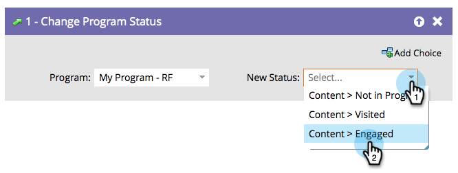

# Change Program Status {#change-program-status}

Program statuses help you keep track of how people are progressing through a program or event. Find more information in [Customize, Create, And Manage Channels](/help/marketo/product-docs/administration/tags/create-a-program-channel.md){target="_blank"}.

>[!CAUTION]
>
>Changing the program status in an engagement program will automatically add them into the first stream. They will begin receiving content.

1. Drag in the **[!UICONTROL Change Program Status]** flow step.

   

1. Select the **[!UICONTROL New Status]** you want to set. The person will also be made a member of the program if they weren't already.

   

Choices are limited to valid statuses for that program.

>[!NOTE]
>
>A person cannot move backwards to an earlier program status as defined in the Channel editor in Admin.

Statuses are powerful tools for keeping track of people and for reporting.
