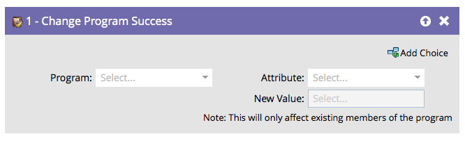
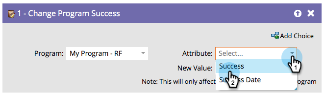

# Change Program Success {#change-program-success}

If you ever have a group of people that are marked with Program Success incorrectly, you can use this flow step to set success to true or false.

1. When you drag in this flow step, the program will automatically be set to the program that contains the smart campaign you're editing.

   >[!NOTE]
   >
   >Only members of the program will be affected.

   

1. Select **[!UICONTROL Success]** or **[!UICONTROL Success Date]** as the Attribute.

   

   >[!NOTE]
   >
   >Setting [!UICONTROL Success Date] to anything automatically sets Success to true. Setting [!UICONTROL Success] to true automatically sets the Success Date to the current date.

1. Set the **[!UICONTROL New Value]** to **[!UICONTROL True]** or **[!UICONTROL False]**.

   

   >[!TIP]
   >
   >You can use the flow step twice to set both the Success flag as well as the date.

Great! Now you know how to undo and force success.
