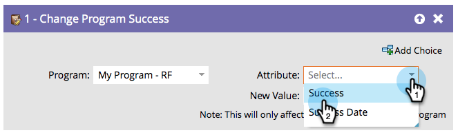
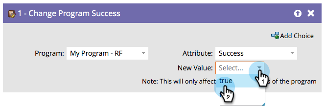

# Change Program Success {#change-program-success}

#### Overview {#overview}

If you ever have a group of people that are marked with Program Success accidentally, you can use this flow step to set success to true or false.

  

#### Usage {#usage}

1. When you drag in this flow step, the program will automatically be set to the program that contains the smart campaign you're editing.

   >[!NOTE]
   >
   >Only members of the program will be affected.

   

1. Select **Success** or** Success Date** as the Attribute.

   

   >[!NOTE]
   >
   >Setting Success Date to anything automatically sets Success to true. Setting Success to true automatically sets the Success Date to the current date.

1. Set the **New Value** to **True** or **False**.

   

   >[!TIP]
   >
   >You can use the flow step twice to set both the Success flag as well as the date.

Great! Now you know how to undo and force success. 