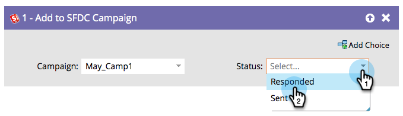

# Add to SFDC Campaign {#add-to-sfdc-campaign}

>[!NOTE]
>
>Only available when integrated with Salesforce.

## Overview {#overview}

This flow step can be used in Marketo campaigns or as a single flow step to add people as leads in a Salesforce campaign. If the lead does not yet exist in Salesforce, it will automatically be synced over and added to the campaign with the specified status.

## Usage {#usage}

1. Find and select the Salesforce campaign you want to add your leads to.

   

   >[!TIP]
   >
   >If you can't see a Salesforce campaign in the Campaign list:
   >
   >  1. Make sure the [campaign sync is enabled](/help/marketo/product-docs/crm-sync/salesforce-sync/setup/optional-steps/enable-disable-campaign-sync.md).
   >  1. Confirm that your [Marketo Sync User](/help/marketo/product-docs/crm-sync/salesforce-sync/setup/enterprise-unlimited-edition/step-2-of-3-create-a-salesforce-user-for-marketo-enterprise-unlimited.md) is a [Marketing User](/help/marketo/product-docs/crm-sync/salesforce-sync/setup/optional-steps/enable-disable-campaign-sync/make-marketo-sync-user-a-marketing-user.md) in Salesforce.

   >[!TIP]
   >
   >You can use Salesforce campaign [My Tokens](/help/marketo/product-docs/core-marketo-concepts/programs/tokens/managing-my-tokens.md) to make program cloning easier.

1. Select the Salesforce campaign member status you want to assign to leads when they're added.

   

   >[!CAUTION]
   >
   >If a person is already a lead member of the Salesforce campaign, they will be skipped and their status will NOT be updated. You can use [change their status in an SFDC campaign](/help/marketo/product-docs/core-marketo-concepts/smart-campaigns/salesforce-flow-actions/change-status-in-sfdc-campaign.md) instead.
