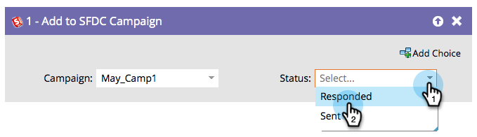

# Add to SFDC Campaign {#add-to-sfdc-campaign}

This flow step can be used in Marketo Engage campaigns or as a single flow step to add people as leads in a Salesforce campaign. If the lead does not yet exist in Salesforce, it will automatically be synced over and added to the campaign with the specified status.

>[!NOTE]
>
>Only available when integrated with [!DNL Salesforce].

## Usage {#usage}

1. Find and select the [!DNL Salesforce] campaign you want to add your leads to.

   

   >[!TIP]
   >
   >If you cannot see a Salesforce campaign in the campaign list:
   >
   > 1. Verify the [campaign sync is enabled](/help/marketo/product-docs/crm-sync/salesforce-sync/setup/optional-steps/enable-disable-campaign-sync.md){target="_blank"}.
   > 1. Confirm that your [Marketo Sync User](/help/marketo/product-docs/crm-sync/salesforce-sync/setup/enterprise-unlimited-edition/step-2-of-3-create-a-salesforce-user-for-marketo-enterprise-unlimited.md){target="_blank"} is a [Marketing User](/help/marketo/product-docs/crm-sync/salesforce-sync/setup/optional-steps/enable-disable-campaign-sync/make-marketo-sync-user-a-marketing-user.md){target="_blank"} in Salesforce.

   >[!TIP]
   >
   >You can use Salesforce campaign [My Tokens](/help/marketo/product-docs/core-marketo-concepts/programs/tokens/managing-my-tokens.md){target="_blank"} to make program cloning easier.

1. Select the [!DNL Salesforce] campaign member status you want to assign to leads when they're added.

   

   >[!CAUTION]
   >
   >If a person is already a lead member of the Salesforce campaign, they will be skipped and their status will NOT be updated. You can use [change their status in an SFDC campaign](/help/marketo/product-docs/core-marketo-concepts/smart-campaigns/salesforce-flow-actions/change-status-in-sfdc-campaign.md){target="_blank"} instead.
