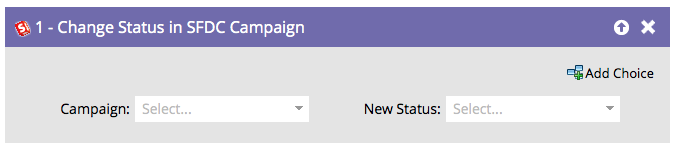
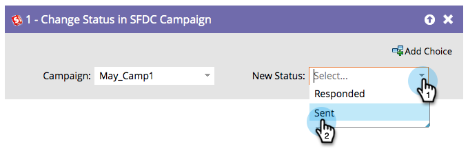

# Change Status in SFDC Campaign {#change-status-in-sfdc-campaign}

This flow step allows you to change the Salesforce campaign member status of leads.

>[!NOTE]
>
>Only available when integrated with Salesforce.

If a lead does not exist in Salesforce or is not a member of the campaign yet, it will automatically be synced and added to the Salesforce campaign with the appropriate status.

1. First find and select the Salesforce **[!UICONTROL Campaign]** the record is in.

   

1. Then select the **[!UICONTROL New Status]** you want to set, and you're done!

   
