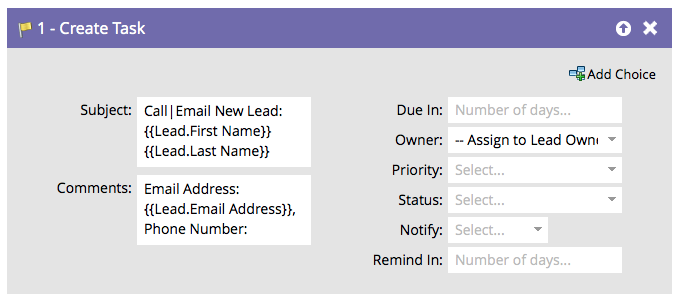

# Create Task {#create-task}

As a marketer, you have information that can assist sales in closing deals. You can create tasks to let them know what they should do and when they should do it.

>[!NOTE]
>
>When the Marketo Sync User is creating tasks, **Due In** is a required field for the task to be created in Salesforce. Marketo will input five days by default if there is no value.

By default, the flow step will look like this:   

Customize all fields to create the task the way you want it.

>[!TIP]
>
>You can use {{lead.tokens}}, {{company.tokens}}, {{campaign.tokens}} and {{system.tokens}} in the **Subject** and **Description**. See  [Tokens for Flow Steps](../../../../product-docs/core-marketo-concepts/smart-campaigns/flow-actions/use-tokens-in-flow-steps.md) for more details.

