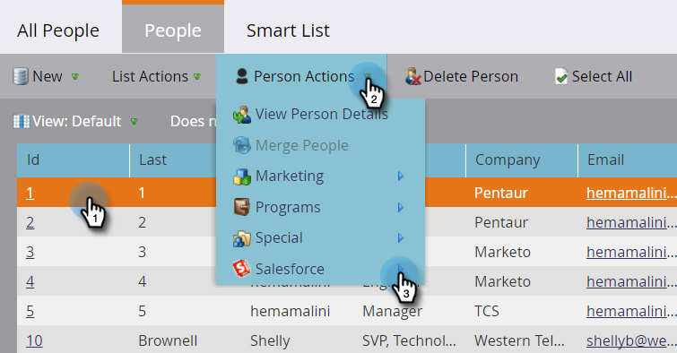

# Delete Person from SFDC {#delete-person-from-sfdc}

If you need to remove a specific set of leads from Salesforce but leave them as people in Marketo, you can use the Delete Person from SFDC flow action.

>[!NOTE]
>
>Only available when integrated with Salesforce.

1. In the Database, click the person you want to remove from Salesforce. Then click **Person Actions** and select **Salesforce**.

   

1. Select **Delete Person from SFDC**.

   

1. Be sure the **Delete in Marketo** setting is **false**, then click **Run Now**.

   

   After the flow step runs, your person will no longer be a lead in Salesforce but will remain in Marketo.

   >[!CAUTION]
   >
   >If you set **Delete in Marketo** to **true** and delete the people from Marketo and the leads from Salesforce, they are gone forever. This can't be undone.
