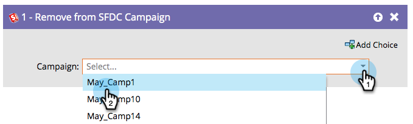

# Remove from SFDC Campaign {#remove-from-sfdc-campaign}

>[!NOTE]
>
>Only available when integrated with Salesforce.

## Overview {#overview}

Just like how you can [Add to SFDC Campaign](/help/marketo/product-docs/core-marketo-concepts/smart-campaigns/salesforce-flow-actions/add-to-sfdc-campaign.md) and [Change Status in SFDC Campaign](/help/marketo/product-docs/core-marketo-concepts/smart-campaigns/salesforce-flow-actions/change-status-in-sfdc-campaign.md), you can also remove people or leads from a Salesforce campaign.

## Usage {#usage}

1. Once you drag in the flow step, find and select the Salesforce campaign you want to remove the person or lead from.

   

   >[!TIP]
   >
   >If the person or lead is not a member of the campaign you selected, they will be skipped.

That's it! When people or leads flow through, they will be removed from the Salesforce campaign you chose.
