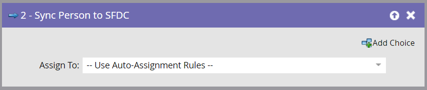

# Sync Person to SFDC {#sync-person-to-sfdc}

>[!NOTE]
>
>**FYI**
>
>Marketo is now standardizing language across all subscriptions, so you may see lead/leads in your subscription and person/people in docs.marketo.com. These terms mean the same thing; it does not affect article instructions. There are some other changes, too. [Learn more](http://docs.marketo.com/display/DOCS/Updates+to+Marketo+Terminology).

>[!NOTE]
>
>Only available when integrated with Salesforce.

## Overview {#overview}

This flow step will insert Marketo-created people as leads into your Salesforce CRM.

## Usage {#usage}

1. By default, this flow step will assign to lead owners based on the Salesforce auto-assignment rules.

   

   >[!TIP]
   >
   >Salesforce requires that the person has Company and&nbsp;Last Name fields filled out.&nbsp;Otherwise, it will reject the lead record.

1. You can set a specific Salesforce user or lead queue as the lead owner.

   

   When using this flow step, the person is synced as a Salesforce lead immediately and does not need to wait for the regular sync.

   >[!CAUTION]
   >
   >Salesforce does not allow "Contacts" to be assigned to lead queues. In this case Marketo will create a duplicate "Lead" in Salesforce.

