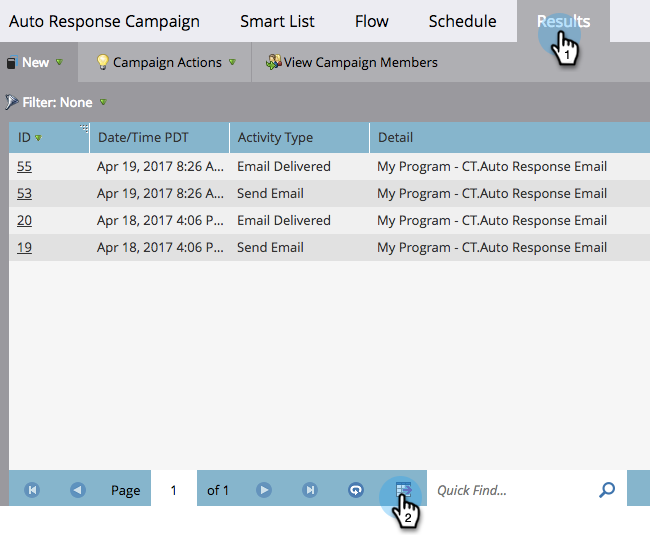

# Export Smart Campaign Results to [!DNL Excel] {#export-smart-campaign-results-to-excel}

Export your Smart Campaign results to Excel for use outside of Marketo Engage.

1. In your Smart Campaign, click the **[!UICONTROL Results]** tab, then the export icon at the bottom.

   

   Your results are exported and ready to use!

   >[!NOTE]
   >
   >The export is limited to 20,000 rows. The [!DNL Excel] file is saved in your browser's default downloads folder.
