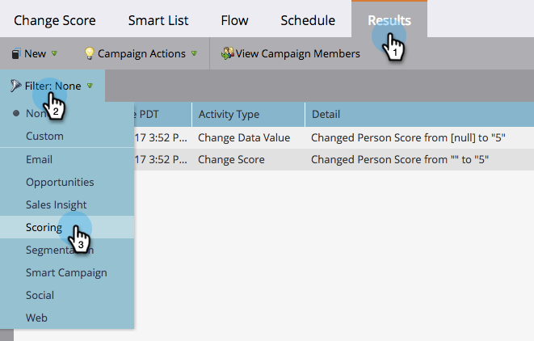
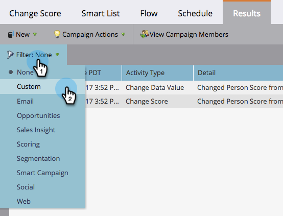
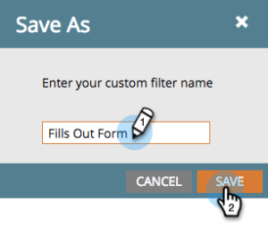
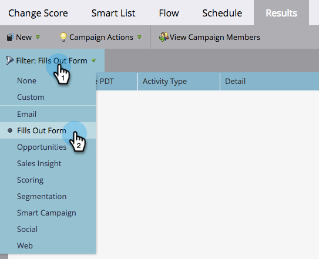

# Filter Smart Campaign Results {#filter-smart-campaign-results}

>[!PREREQUISITES]
>
>[View Smart Campaign Results](/help/marketo/product-docs/core-marketo-concepts/smart-campaigns/smart-campaign-data/view-smart-campaign-results.md)

Filter Smart Campaign results to see specific activities that matter to you.

## Filter by Saved Filters {#filter-by-saved-filters}

1. In your Smart Campaign **[!UICONTROL Results]** tab, click **[!UICONTROL Filter]** and select a saved filter.

   

   >[!NOTE]
   >
   >By default, there are no filters applied and results show all activities.

## Create a Custom Filter {#create-a-custom-filter}

1. Click **[!UICONTROL Filter]**, then **[!UICONTROL Custom]**.

   

1. Select activity types that you want to see and click **[!UICONTROL Save As]**.

   

   >[!TIP]
   >
   >Click **[!UICONTROL Apply]** to directly apply a custom filter to your results without saving it.

1. Enter a filter name and click **[!UICONTROL Save]**.

   

1. The custom filter will be applied to your results and is now available in the drop-down (you may have to refresh the page to see it in the drop-down).

   
