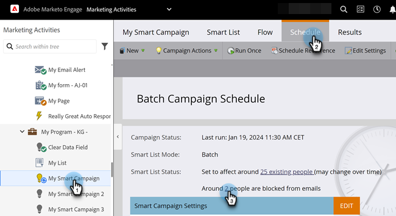
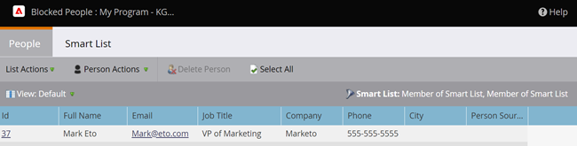

# View Blocked People in a Smart Campaign {#view-blocked-people-in-a-smart-campaign}

Blocked people in the Marketo Engage database are marked blocklisted, unsubscribed, marketing suspended, and/or have an invalid or empty email.

1. In your Smart Campaign, click **[!UICONTROL Schedule]**. Under **[!UICONTROL Smart List Status]**, click the second link.

   

   >[!NOTE]
   >
   >People who have reached their communication limits may also be blocked from receiving mails. Learn how to [edit communication limits](/help/marketo/product-docs/administration/email-setup/enable-communication-limits.md){target="_blank"} in the Admin section.

   The **[!UICONTROL Blocked Leads]** tab shows people who might not receive mailings.

   

   >[!NOTE]
   >
   >Operational emails will be sent to people marked unsubscribed and marketing suspended.

   >[!MORELIKETHIS]
   >
   >* [Edit Qualification Rules](/help/marketo/product-docs/core-marketo-concepts/smart-campaigns/using-smart-campaigns/edit-qualification-rules-in-a-smart-campaign.md){target="_blank"}
   >* [Enable Communication Limits](/help/marketo/product-docs/administration/email-setup/enable-communication-limits.md){target="_blank"}
   >* [View Smart Campaign Members](/help/marketo/product-docs/core-marketo-concepts/smart-campaigns/smart-campaign-data/view-smart-campaign-members.md){target="_blank"}
   >* [View Qualified People in a Smart Campaign](/help/marketo/product-docs/core-marketo-concepts/smart-campaigns/smart-campaign-data/view-qualified-people-in-a-smart-campaign.md){target="_blank"}
