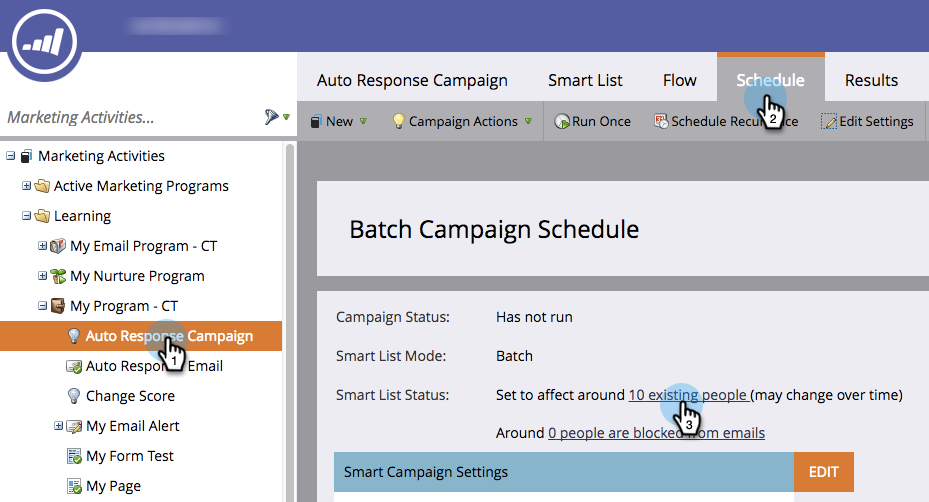
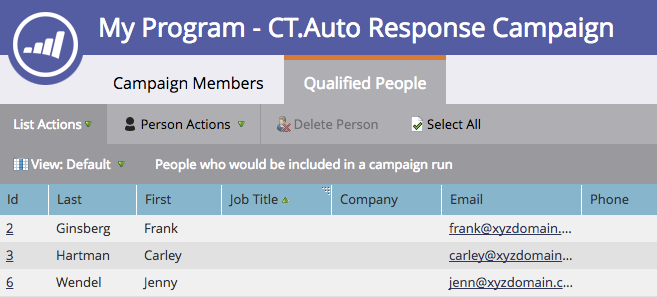

# View Qualified People in a Smart Campaign {#view-qualified-people-in-a-smart-campaign}

View people who qualify to go through the flow when you run a smart campaign.

1. In your smart campaign, click on Schedule. In the Smart List Status, click on the first link.

>[!NOTE]
>
>Trigger smart campaigns do not display qualified people, since they run based on live events.

1. The **Qualified People** tab lists the people who qualify to go through the flow when the campaign runs.

   

   >[!CAUTION]
   >
   >The Qualified People list does not account for people who are blocked or have reached their communication limits.

   >[!NOTE]
   >
   >The number of qualified people also depends on the smart campaign qualification rules. Learn how to [edit qualification rules](../../../../product-docs/core-marketo-concepts/smart-campaigns/using-smart-campaigns/edit-qualification-rules-in-a-smart-campaign.md).

Sweet! You can use this list to check which people might go through the flow before you run a smart campaign. 

>[!NOTE]
>
>**Related Articles**
>
>* [View Smart Campaign Members](view-smart-campaign-members.md)
>* [View Blocked People in a Smart Campaign](view-blocked-people-in-a-smart-campaign.md)
>* [Add a Flow Step to a Smart Campaign](../../../../product-docs/core-marketo-concepts/smart-campaigns/flow-actions/add-a-flow-step-to-a-smart-campaign.md)
>

