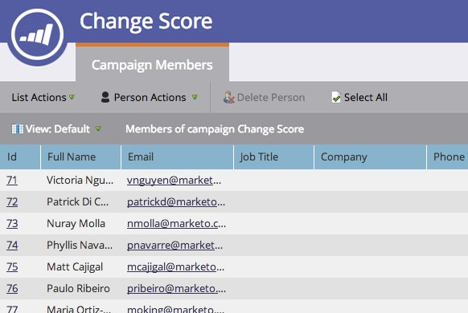

# View Smart Campaign Members {#view-smart-campaign-members}

View people who have already run through the Smart Campaign flow; i.e., Smart Campaign members.

1. Go to **[!UICONTROL Marketing Activities]**.

1. In your Smart Campaign, click **[!UICONTROL View Campaign Members]**.

   

>[!TIP]
>
>You can view campaign members from anywhere within a Smart Campaign.

1. The **[!UICONTROL Campaign Members]** tab shows people that have already run through the Smart Campaign flow.

   

   >[!NOTE]
   >
   >The Campaign Members list will initially be empty when the Smart Campaign has not run on any people.

   >[!MORELIKETHIS]
   >
   >[View Blocked People in a Smart Campaign](/help/marketo/product-docs/core-marketo-concepts/smart-campaigns/smart-campaign-data/view-blocked-people-in-a-smart-campaign.md){target="_blank"}
