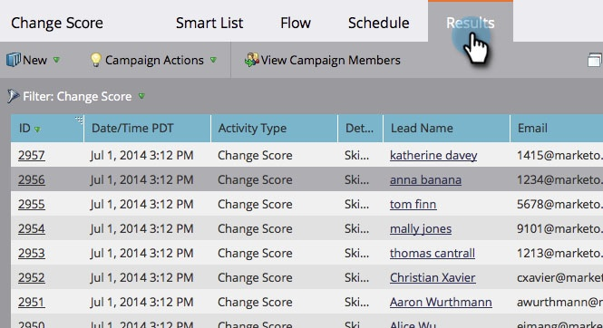

# View Smart Campaign Results {#view-smart-campaign-results}

Want to see a breakdown of everything that happened in a smart campaign? It's easy, here's how.

1. In your smart campaign, click **Results**.

   >[!TIP]
   >
   >You can see the list of people who were processed by the smart campaign by clicking [View Campaign Members](/help/marketo/product-docs/core-marketo-concepts/smart-campaigns/smart-campaign-data/view-smart-campaign-members.md).

   

   >[!TIP]
   >
   >You can also filter the results based on activity type. Learn how to [filter smart campaign results](/help/marketo/product-docs/core-marketo-concepts/smart-campaigns/smart-campaign-data/filter-smart-campaign-results.md).

1. Click an **ID** to view more detail about that particular activity.

   

   >[!TIP]
   >
   >View person details by clicking the person's name.

   Dig into the results to see what your campaign actually did, or simply [export smart campaign results to Excel](/help/marketo/product-docs/core-marketo-concepts/smart-campaigns/smart-campaign-data/export-smart-campaign-results-to-excel.md).

   >[!MORELIKETHIS]
   >
   >[Filter Smart Campaign Results](/help/marketo/product-docs/core-marketo-concepts/smart-campaigns/smart-campaign-data/filter-smart-campaign-results.md)
