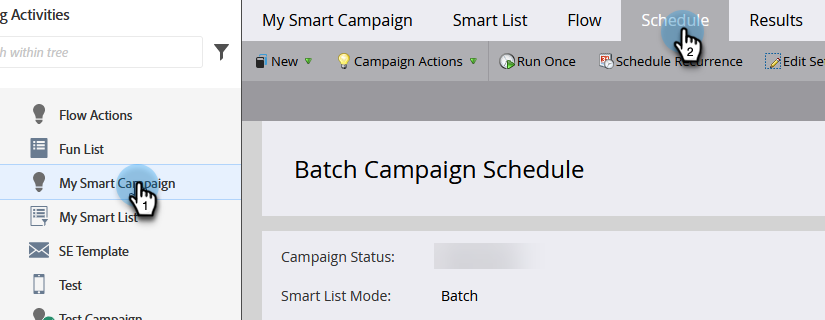
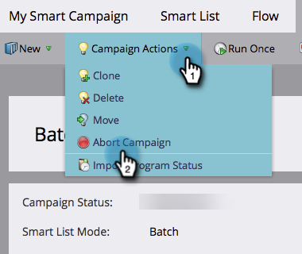
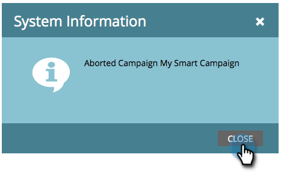

# Abort a Smart Campaign {#abort-a-smart-campaign}

>[!CAUTION]
>
>For Emergency Use Only

Sometimes you launch a Smart Campaign and immediately realize it was a mistake. Here's how to pull the emergency brake and stop the Smart Campaign mid-run.

1. Choose the desired Smart Campaign and click the **Schedule** tab.

   

1. Click the **Campaign Actions** drop-down. Select **Abort Campaign**.

   

1. Click **Abort** to confirm.

   

   >[!NOTE]
   >
   >Aborting does not undo steps already finished, it just stops more from happening (example: emails can't be undelivered).

   

   >[!NOTE]
   >
   >Take a look at the **Results** tab of the Smart Campaign to see what actions took place before the abort. You will also find a  [notification](/help/marketo/product-docs/core-marketo-concepts/miscellaneous/understanding-notifications.md) with additional details.

   >[!TIP]
   >
   >Want to remove a person from the flow in a trigger campaign? Check out [Remove from Flow](/help/marketo/product-docs/core-marketo-concepts/smart-campaigns/flow-actions/remove-from-flow.md).

Always double-check your work, but this emergency brake may come in handy in the future.
