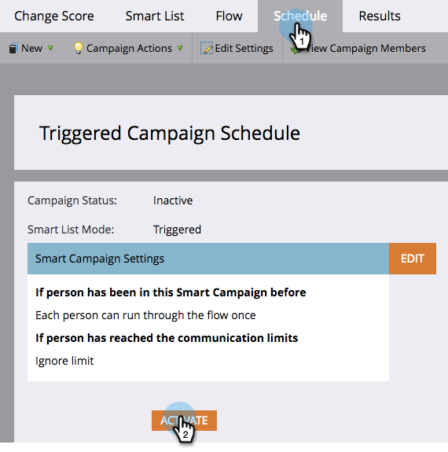

# Activate a Trigger Smart Campaign | Schedule Tab {#activate-a-trigger-smart-campaign-schedule-tab}

Activating a trigger Smart Campaign is like turning it ON. Here's what to do.

1. In the Smart Campaign's **Schedule** tab, click **Activate**.

   

   >[!TIP]
   >
   >Review the Smart Campaign before activating.

1. Click **Activate** again.

   

   >[!CAUTION]
   >
   >Make sure the campaign is ready before you activate!

From this moment forward, anyone who qualifies for the Smart List will go through the flow defined by your Smart Campaign.
