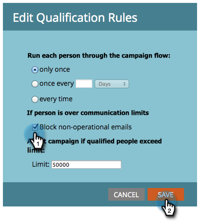

# Apply Communication Limits to Smart Campaign {#apply-communication-limits-to-smart-campaign}

>[!PREREQUISITES]
>
>[Enable Communication Limits](/help/marketo/product-docs/administration/email-setup/enable-communication-limits.md)
>

It's not a good idea to email someone multiple times a day or too many times in a week, right? Luckily, Marketo has communication limits to help. Here's how they work.

>[!NOTE]
>
>When any person exceeds the set communication limits, Marketo blocks non-operational emails (operational emails always send).

1. In your smart campaign, click the **Schedule** tab and then **Edit Settings**.

   

1. Check the **Block non-operational emails** checkbox, and then click **Save**.

   

>[!NOTE]
>
>Limit refers to the number of qualified people a smart campaign can affect.

>[!TIP]
>
>To make this the default, edit your  [communication limits](/help/marketo/product-docs/administration/email-setup/enable-communication-limits.md) in the Admin section.

Sweet. Now you can be assured you aren't accidentally sending too many emails to your audience.
