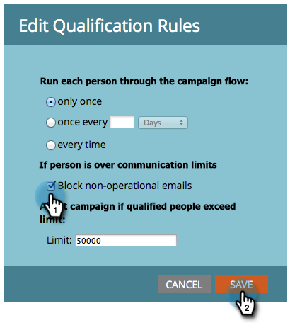

# Apply Communication Limits to Smart Campaign {#apply-communication-limits-to-smart-campaign}

>[!PREREQUISITES]
>
>[Enable Communication Limits](/help/marketo/product-docs/administration/email-setup/enable-communication-limits.md){target="_blank"}

It is not a good idea to email someone multiple times a day, or too many times in a week, right? Luckily, Marketo Engage has communication limits to help.

>[!NOTE]
>
>When any person exceeds the set communication limits, Marketo blocks non-operational emails (operational emails always send).

1. In your Smart Campaign, click the **[!UICONTROL Schedule]** tab and then **[!UICONTROL Edit Settings]**.

   

1. Check the **[!UICONTROL Block non-operational emails]** checkbox, and then click **[!UICONTROL Save]**.

   

>[!NOTE]
>
>Limit refers to the number of qualified people a Smart Campaign can affect.

>[!TIP]
>
>To make this the default, edit your [communication limits](/help/marketo/product-docs/administration/email-setup/enable-communication-limits.md){target="_blank"} in the Admin section.

Now you can be assured you are not accidentally sending too many emails to your audience.
