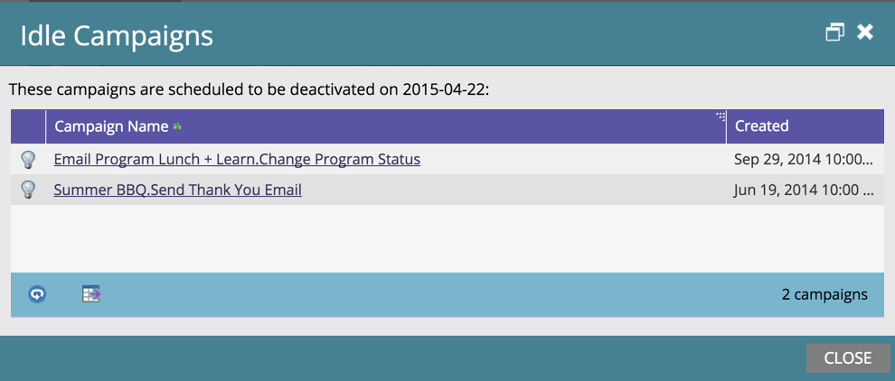
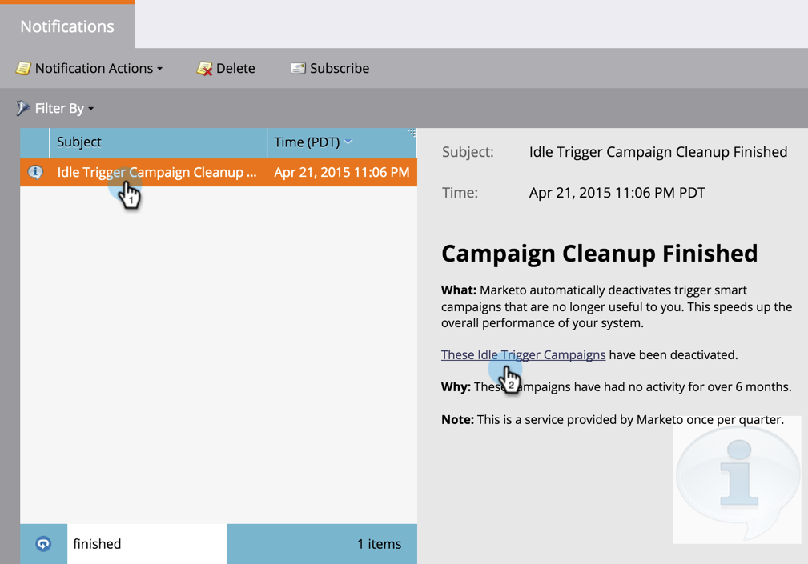

# Automatic Trigger Campaign Cleanup {#automatic-trigger-campaign-cleanup}

Marketo has a nice/free service to deactivate triggered smart campaigns that no longer get activity. This speeds up overall system performance and saves you time.

## What happens? {#what-happens}

Once a quarter, Marketo will find smart campaigns that have sat dormant (no people) for 6 months or more and deactivate them.

## Will you notify me first? {#will-you-notify-me-first}

Of course! Once a quarter, you will receive a notification one week in advance showing every campaign we plan on deactivating.

1. Go to the **Notifications** tab.

   

1. Click **Idle Trigger Campaign Cleanup Scheduled**. Then click the **These Idle Trigger Campaigns will be deactivated **link.** **

   

   You will see a list of smart campaigns scheduled to be deactivated.

   

## Which campaigns will be deactivated? {#which-campaigns-will-be-deactivated}

We will only deactivate trigger campaigns that have been active for over 6 months but have had 0 people qualify in that time period.

## Wait! Not this campaign! {#wait-not-this-campaign}

Don't worry - the clock on any smart campaign can be reset by:

* A person qualifying for the campaign.
* Manually deactivating and reactivating the campaign.

Either will reset the 6-month counter.

## Will you let me know which campaigns were deactivated? {#will-you-let-me-know-which-campaigns-were-deactivated}

Absolutely - one week after the original notification, we will deactivate the listed campaigns (minus any that qualified at least one person or were deactivated/reactivated) and post a confirmation notification.

1. Select the **Idle Trigger Campaign Cleanup Scheduled **notification. Click the **These Idle Trigger Campaigns** link. 

   

1. You will see a list of deactivated campaigns.

   

