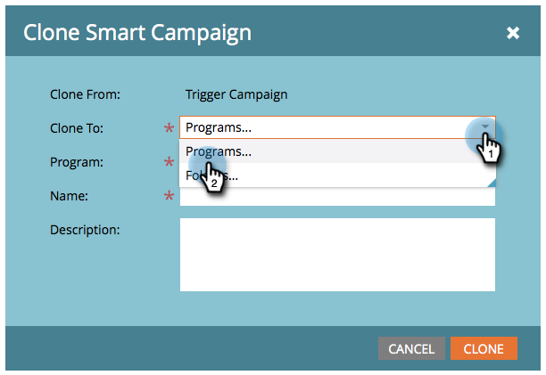

# Campaign Actions: Clone a Smart Campaign {#campaign-actions-clone-a-smart-campaign}

Cloning campaigns can save you time. No need to build everything from scratch - cloning creates an identical campaign with the exact same smart list filters and flow steps.

1. Find the campaign you want to clone, select it, then under **Campaign Actions** click on **Clone**.

   

1. Choose the appropriate **Clone To** option. In this example, let's choose **Programs**.

   

1. Choose a **Program**. Enter a **Campaign Name** and click **Clone**.

   

And done!
