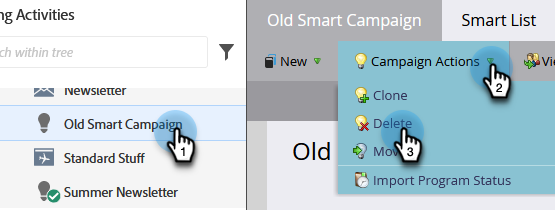

# Campaign Actions: Delete a Smart Campaign {#campaign-actions-delete-a-smart-campaign}

If you have an old smart campaign that you don't need anymore, you can delete it. Here's how.

>[!CAUTION]
>
>Be sure before you delete. Once you delete a smart campaign it cannot be restored.

1. Go to the **Marketing Activities** area.

   

1. Navigate to your inactive smart campaign. In the **Campaign** **Actions** drop-down, select **Delete**.

   

   >[!TIP]
   >
   >To cancel processing of an active smart campaign without deleting it altogether, learn how to [abort a smart campaign](/help/marketo/product-docs/core-marketo-concepts/smart-campaigns/using-smart-campaigns/abort-a-smart-campaign.md).

1. Click **Delete** to confirm.

   

   >[!CAUTION]
   >
   >Do **NOT** delete an active smart campaign with people in the flow steps. The campaign will likely still execute.
